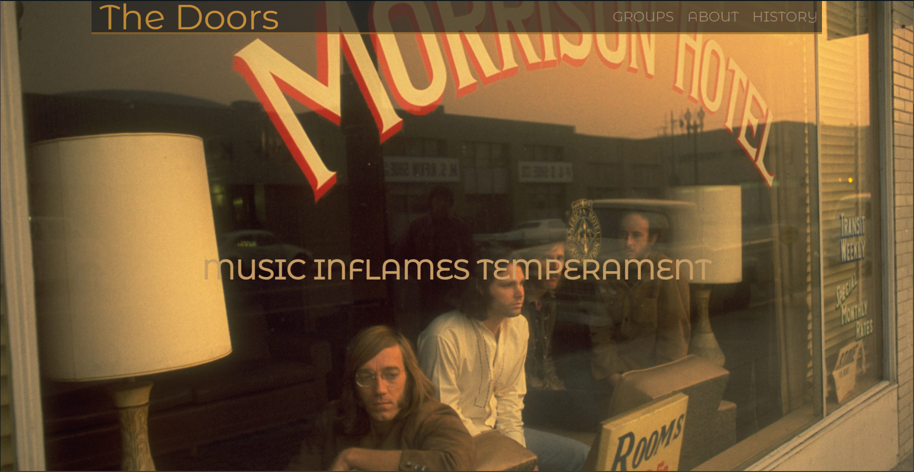
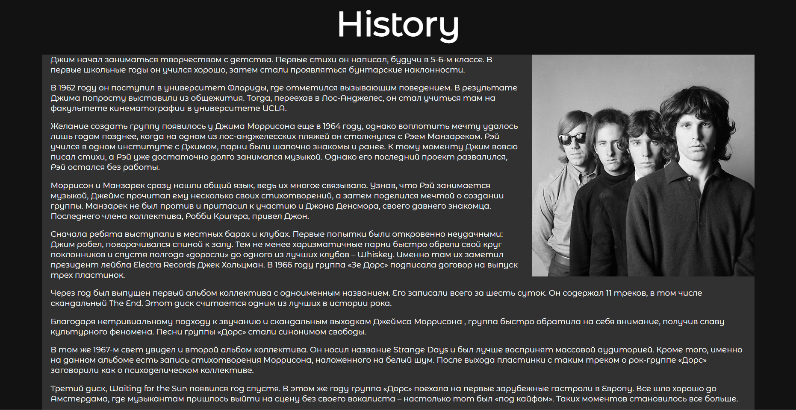
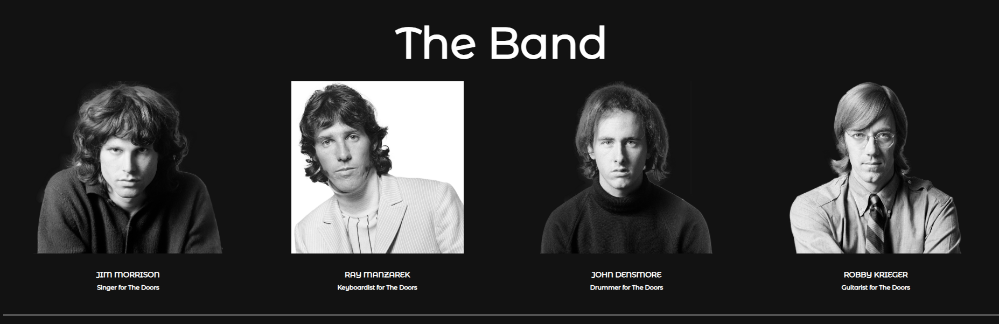
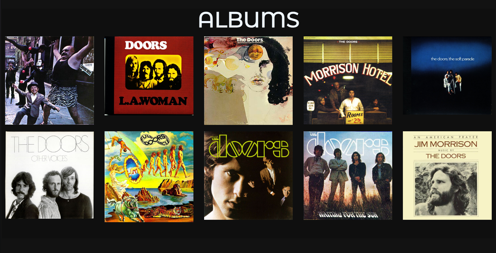

## The_Doors_Site

Этот проект представляет собой сайт, посвященный легендарной рок-группе The Doors. Сайт создан с использованием HTML и включает в себя всю необходимую информацию о группе, а также различные функции и элементы дизайна.
### Описание проекта

The_Doors_Site — это статический сайт, который содержит всевозможную информацию о группе The Doors, их музыке, фотографии, ссылки на социальные сети и многое другое. Сайт имеет привлекательный дизайн и удобный интерфейс.

### Функционал

- Кнопка в хедере с переходами на другие страницы о группе.
- Кнопка для перехода в галерею с фотографиями группы.
- Ссылки на социальные сети The Doors.
- Ссылки на музыку группы, включая альбомы и популярные треки.
- Анимация фотографий для улучшения пользовательского опыта.
- Оглавление с переходами к различным частям сайта.

### Используемые технологии

- HTML
- CSS (для стилизации и анимации)
### Скриншоты дизайна

  
  
  
  
